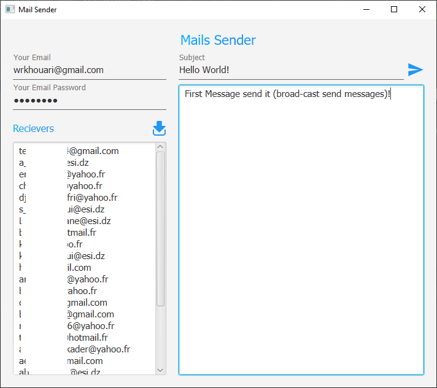

<h1 align="center">Mails Sender :email:</h1>

Desktop App that allow you to send HTML template emails to multiple receivers

  
  

### Why this project?
I had a trouble sending emails because i didn't found tool that allows me to send an email with specific HTML Template to multiple emails with a single click!

### Features
* Very easy to use.
* Send email to multiple receiver.
* Support HTML tags in email content.
* Load emails file (filter & extract emails include it in file).

### Screenshots
| Send Mails (Main App) |
|:--------------:|
|  |

### Requirements
* Java 8
* Maven

### Used Technologies
* JavaFX

### Used Libraries
* Java Mail
* JFoenix
* FontAwesomeFX
